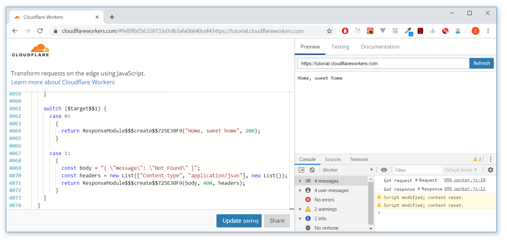
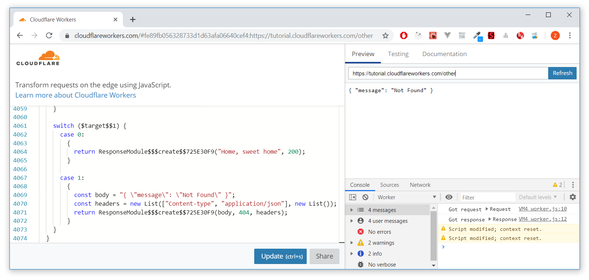

# Fable.CloudFlareWorkers

Write [CloudFlare Workers](https://workers.cloudflare.com/) in idiomatic, type-safe F# and compile them to JS using [Fable](https://github.com/fable-compiler/Fable)

### Install the CloudFlare Worker APIs
```
dotnet add package Fable.CloudFlareWorkers
```
### Write your worker logic in F#
```fs
module App

open CloudFlareWorkers

let worker (request: IHttpRequest) =
    async {
        match request.method, request.path with
        | HttpMethod.GET, "/" ->
            return Response.create(body="Home, sweet home", status=200)

        | HttpMethod.POST, "/echo" ->
            let! body = request.body()
            return Response.create(body=body, status=200)

        | otherwise ->
            let body = "{ \"message\": \"Not Found\" }"
            let headers = Map.ofList [ "content-type", "application/json" ]
            return Response.create(body, status=404, headers=headers)
    }

Worker.initialize worker
```

A "worker" is a function of type `IHttpRequest -> Async<IHttpResponse>` which is what `Worker.initialize` expects. However, you could also implement simple synchronous workers of type `IHttpRequest -> IHttpResponse` and give them to `Worker.initialize`:
```fs
let worker (request: IHttpRequest) =
    match request.method, request.path with
    | HttpMethod.GET, "/" ->
        Response.create(body="Home, sweet home", status=200)

    | otherwise ->
        let body = "{ \"message\": \"Not Found\" }"
        let headers = [ "Content-type", "application/json" ]
        Response.create(body, status=404, headers=headers)

Worker.initialize worker
```

### Making internal requests from the worker

CloudFlare workers are able to `fetch` resources using requests and receive responses. In order to send a request with `fetch`, you have to inside a [Request Context](https://developers.cloudflare.com/workers/about/tips/request-context/). Using this library, you can access the request context and thus use `fetch` by using the type `IRequestContext` as your input of the worker where
```fs
type IRequestContext =
    abstract request : IHttpRequest
    abstract fetch : IHttpRequest -> Async<IHttpResponse>
```
Now build your worker where it expects such context:
```fs
let echo (context: IRequestContext) =
    async {
        let request = context.request
        return! context.fetch request
    }

Worker.initialize echo
```
As simple as that! Here, `Worker.initialize` is using another overload that has type `IRequestContext -> Async<IHttpResponse>`. You can also create your own requests using the `Request.create` function.

### Compiling the project

Use a combination of `fable-splitter` to compile the project into ES6 syntax, then use [rollup](https://rollupjs.org/guide/en/) to bundle the application as a single script. First of all, assuming the directory structure is as follows:
```
{root}
  |
  | -- src
        |
        | -- App.fs
        | -- App.fsproj
  |
  | -- package.json
  | -- README.md
  | -- package-lock.json
```
Install [Fable](https://github.com/fable-compiler/Fable) compiler along with `fable-splitter` and `rollup`:
```
npm install fable-compiler fable-splitter rollup @babel/core --save-dev
```
Then have one npm script to compile the application,  another to bundle it and another that does both:
```json
{
    "compile": "fable-splitter ./src -o ./dist",
    "bundle": "rollup ./dist/App.js -f iife --name App -o ./dist/bundle.js",
    "build": "npm run compile && npm run bundle"
}
```
Notice here that the entry file for `rollup` is `./dist/App.js` that is because `fable-splitter` compiled the entry file `App.fs` as the last file from the F# project which then becomes `App.js`.

Now `rollup` takes this `App.js` entry file and compiles it into a single file as `./dist/bundle.js` this is where your worker script lives.

> As for the  `--name App` flag of rollup, it is used to give the IIFE a name inside the file and it is required but it can be any name you want.

### Testing the worker live

Copy the contents of the file `./dist/bundle.js`, then go to [https://cloudflareworkers.com](https://cloudflareworkers.com) and paste the code to the left, press `CTRL + S` or click the "Update" button to update the code running where the page will show you "Home, sweet home":



If you change the path in the url to something like `/other` then you get the "Not Found" message:



### Resources

- [Cloudflare Workers Documentation](https://developers.cloudflare.com/workers/)

- [CloudFlare Workers Tooling](https://developers.cloudflare.com/workers/tooling/)

- [Joerg Beekmann - Cloudflare Workers in FSharp- Part I](https://github.com/jbeeko/cfworker-hello-world)

- [Joerg Beekmann - Cloudflare Workers in FSharp - II](https://github.com/jbeeko/cfworker-web-api)
